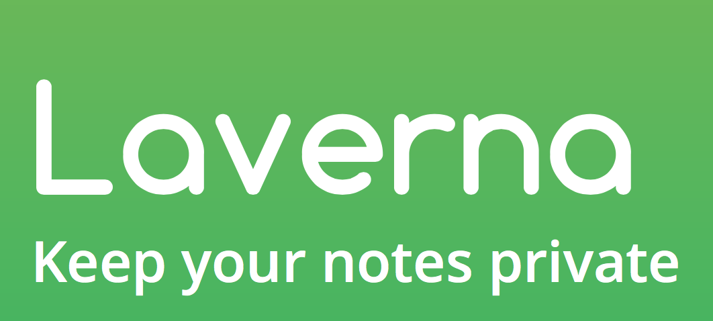

Laverna is a great way for college students to take notes and keep them private. It has a markdown editor which can even help students write faster than ever before. There is also a distraction mode that can keep students from getting distracted while working. It is available anytime and anywhere, so it is perfect for using in class. It has many benefits and is very simple to use. 
