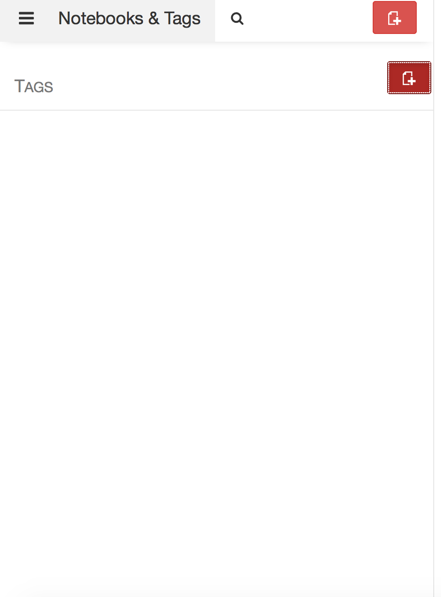

To create a notebook, you will need to find the 3 paralell lines in the far left corner of the window.
  

  
  
  
You will then see the pull down list pictured below. Click on "Notebooks".

  
  
  
The picture below is what you will see after clicking "Notebooks". You now to to click the red paper button with a plus that is beside the finder window and "Notebooks and Tags". This will create a new notebook.

  
  
  
Create a title of your new notebook in the "Title" box and then click the red save button.

  
  
  
You will then see all of your notebooks listed on the left hand side of the window, as picture below. To access a notebook click on the notebook you wish to access.

