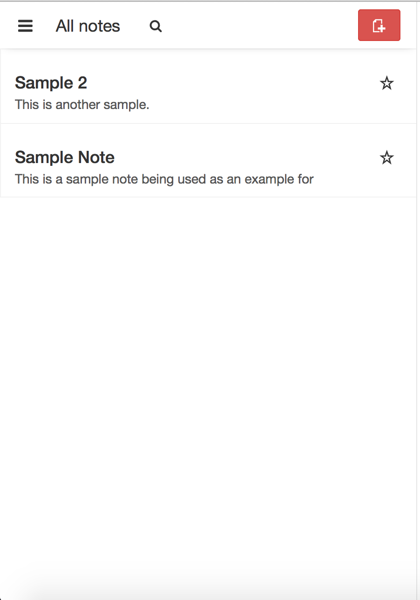

To access all of the notes you have created within Laverna, no matter what notebook they might be in, click the three paralell lines in the top left corner of the window.

  
  
  
The window below will then appear. Click on "All Notes". This will take you to all of the notes you have ever created.

  
  
  
The "All Notes" section should look like below, except with the notes you have created in the left hand column. Click on the note you wish to access.

