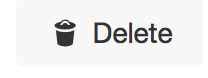
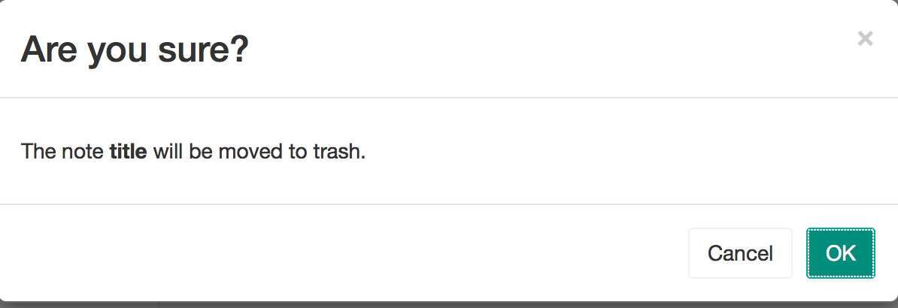

To delete a note, have an existing note open.

  
  
Look in the upper right corner of the window for the white "delete" button pictured below:

  
  
You will then be shown a confirmation window. Click "cancel" to avoid deleting the note, and "OK" to continue with canceling the note.

