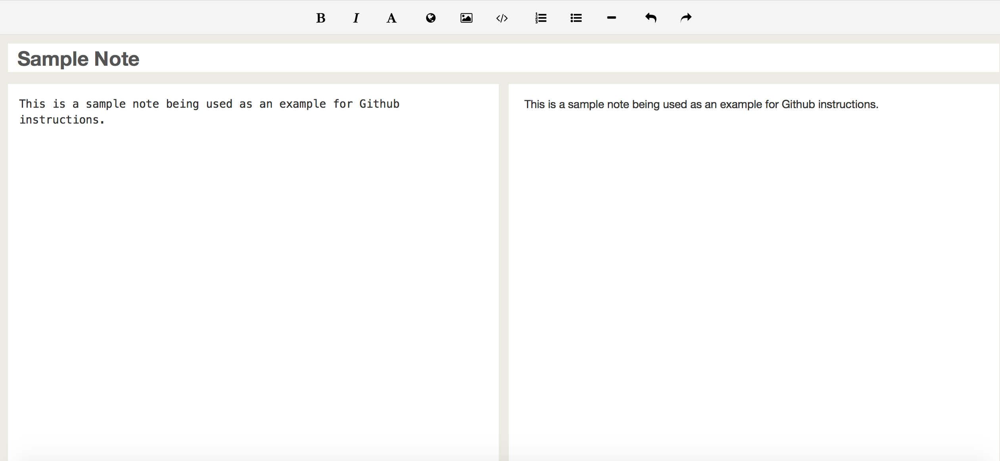
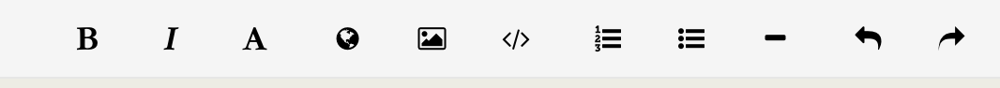

Make sure to have an existing note open in edit mode.

  
  
  
Look for the bar below in the middle of the screen

  
  
  
+ The B is to bold your text, highlight the text you wish to be bolded and click the B
+ The I is to italicize your text, highlight the text you wish to italicize and click the I
+ The A is to make text larger or smaller. Individualized words can not be made smaller or larger, this feature can only be used on whole paragraphs of text.
+ The globe is to add a hyperlink.
+ The < / > feature is to add boxes of text.
+ The numberd feature is to add numbered lists.
+ The dot feature is to add bulleted lists.
+ The dash is to add a line above or below text.
+ The left arrow is to undo text.
+ The right arrow is to redo text.
  
  
  
Remember to click save, to save any text you might have formatted. 

