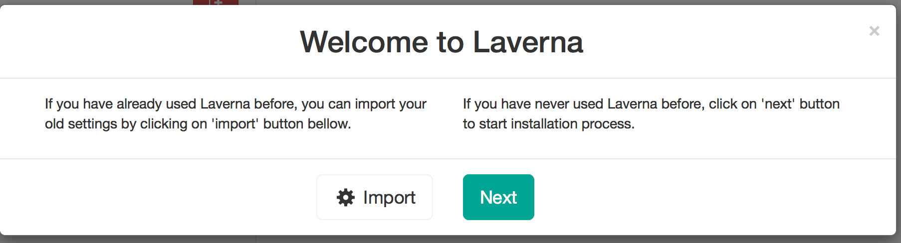
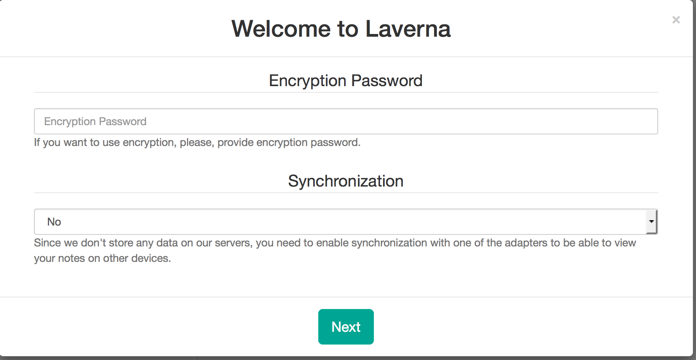
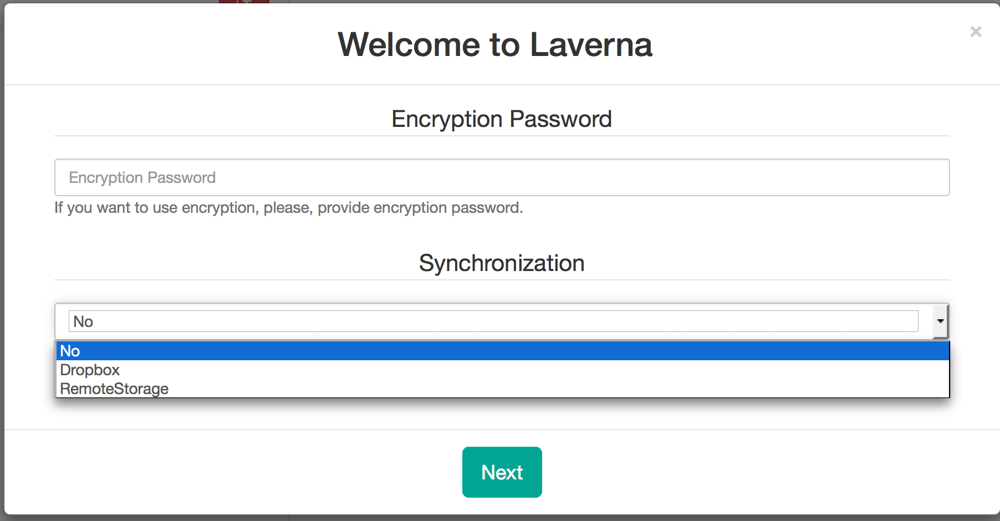

The very first step is to just click the next button:
  

  
  
  
You will then be given this screen. This is asking you if you would like to add a password to your online note account or not. If you choose not to add a password you can add one at a later time. Instructions to adding a password later can be found in the "Other Help" folder. There is also an option to sync your notes to a cloud storage. This feature would give you access to your notes at all times. 

  
  
  
If you choose to sync your notes, you can either sync your notes through DropBox or RemoteStorage. You can also click no if you would not like to sync your notes. This feature can also be added at a later time. Instructions to setting up a DropBox account will be in the "Other Help" folder. You can also find instructions to syncing your account after setup in the "Other Help" folder. 

