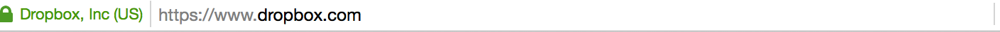
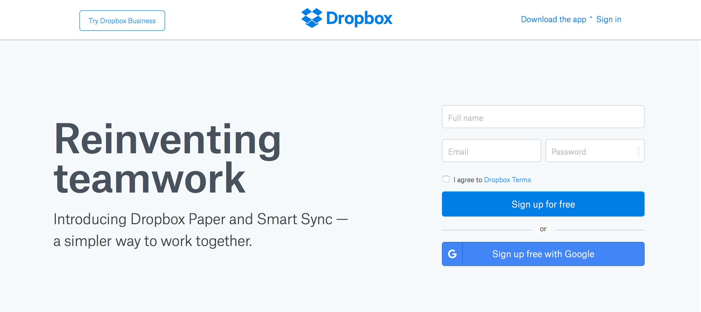
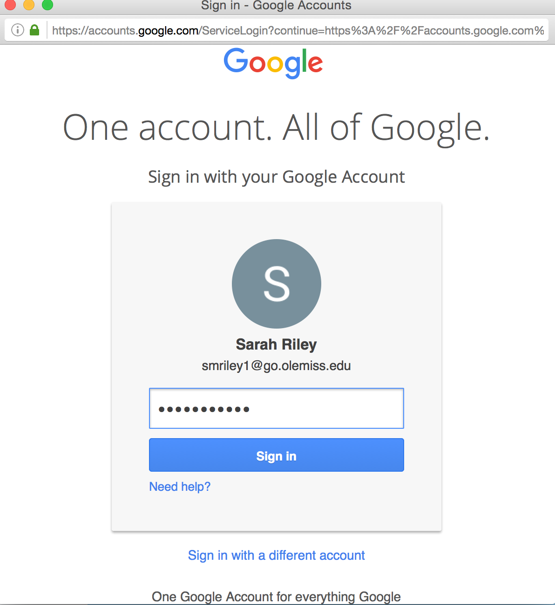
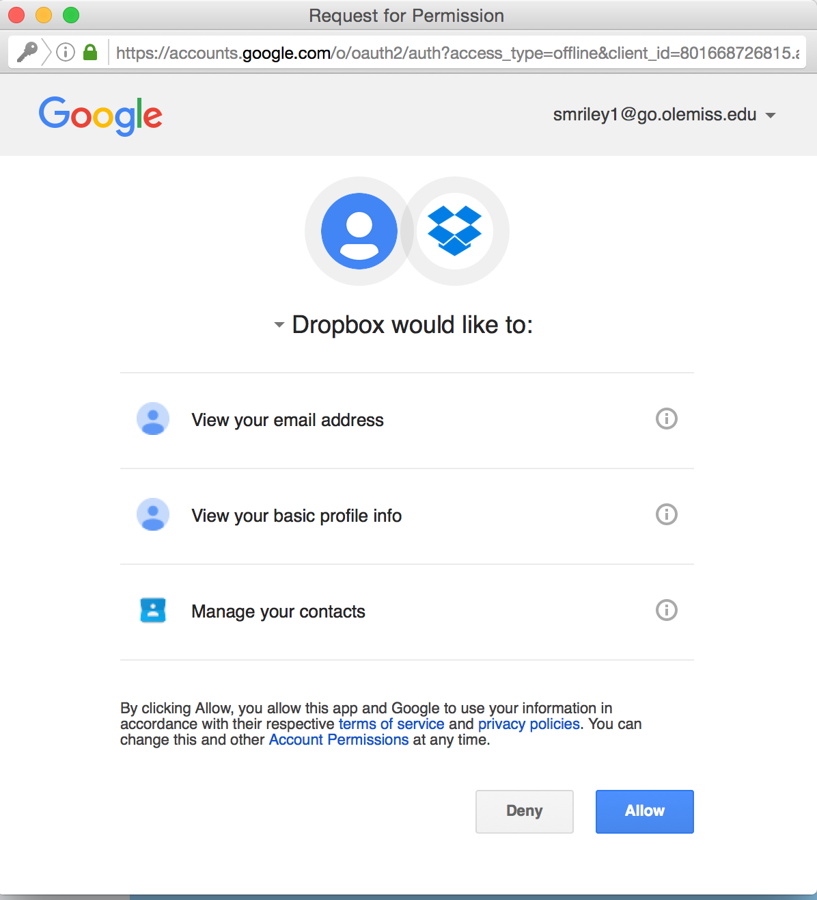
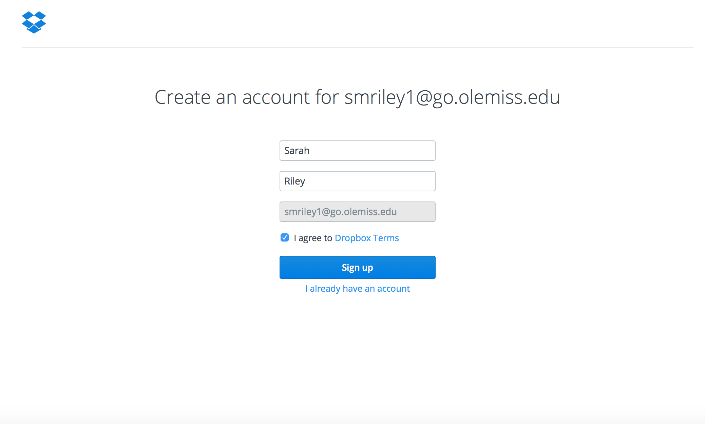

In an internet window, go to the below address.

  
  
You can either create an account or sign in with a Google address. As a college student, you will have a Google address, so the instructions are creating an account with a Google address. Click "sign up for free with Google".

  
  
This window will come up, type in your email address and password. Then, click "sign in".

  
  
You will need to allow DropBox to access your email account. Click "allow" in the bottom right corner.

  
  
Then, you will need to complete the sign up process. The information in the boxes is provided from you email account. Make sure to click the box to agree to the terms and conditions. Then, click "Sign Up".

