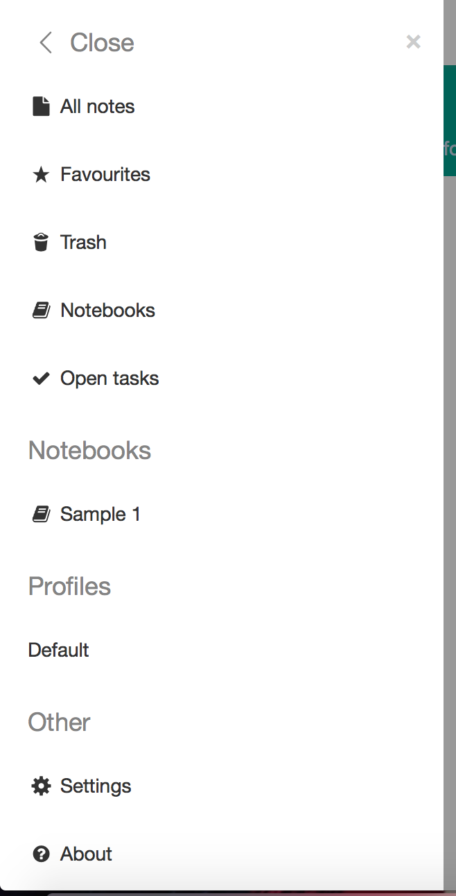
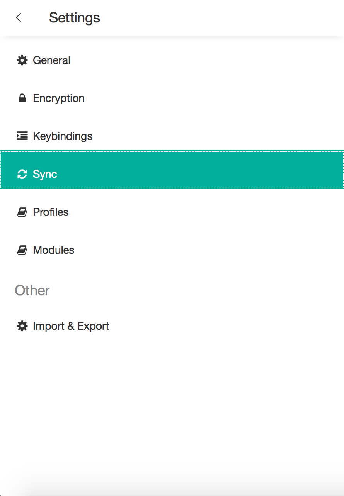
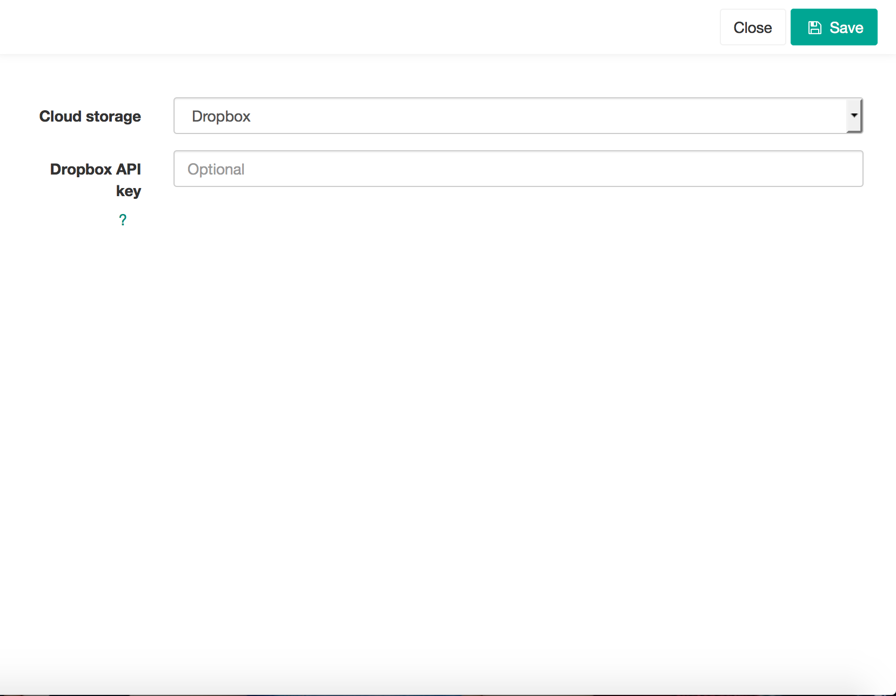
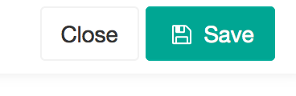
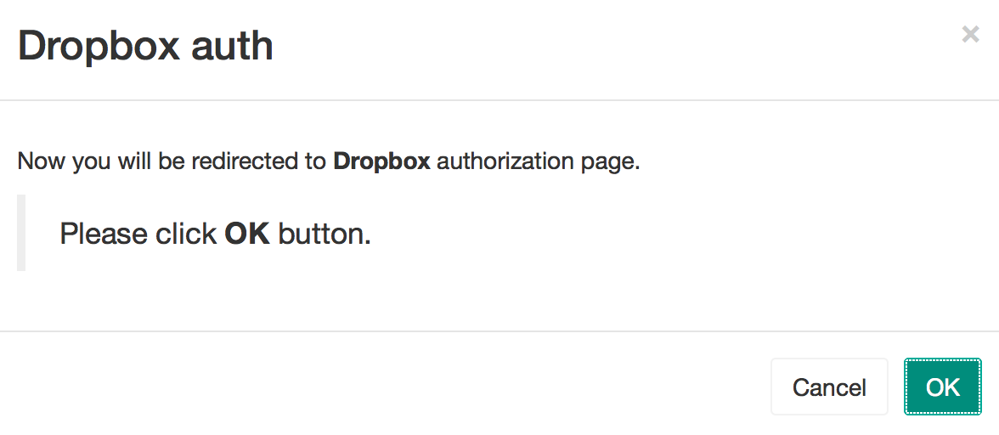
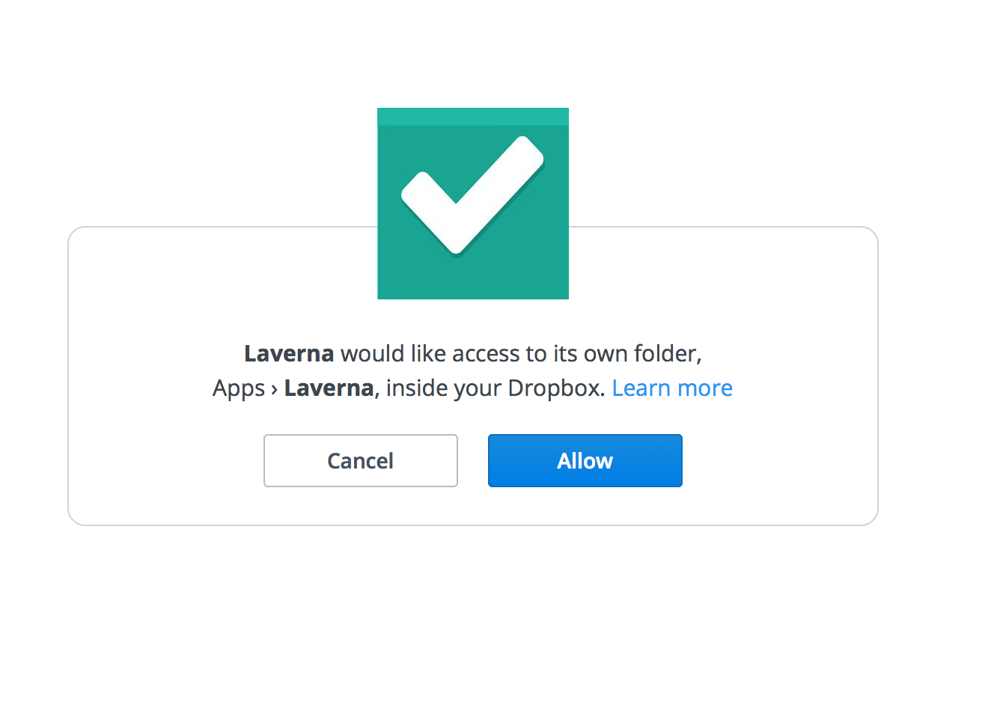

First you will need to create a DropBox account. Instructions on how to create a DropBox account are in the "Other Help" folder.
Then, look for the three paralell lines in the upper left corner of the window. Click the three paralell lines.

  
  
The window above will appear, click "Settings"

  
  
The far left part of the window you will see another list, like below. Click "Sync".

  
  
To the right of the window, the below will appear. Click the dropdown box of "cloud stoarge", and click DropBox.

  
  
Then go to the upper right hand corner of the window, and look for the "save" and "close" buttons. Click the "save" button, then the "close" button.

  
  
The below window will appear, if you are currently logged into your DropBox account. Click the "OK" button to authorize Laverna to access your DropBox account.

  
  
After clicking "OK" for authorization the below window will appear. Click "Allow" to allow Laverna access. Your Laverna notes will now sync to your DropBox account.

