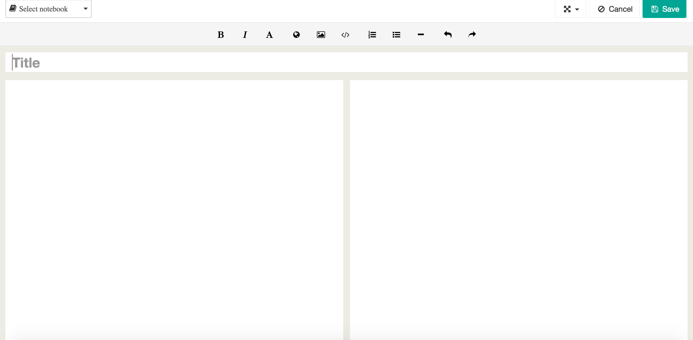
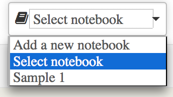
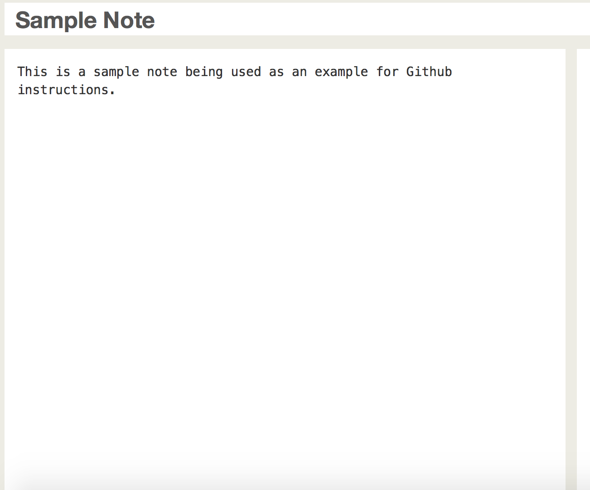

To create a note within Lavera, click on the red box plus image. 
  

  
  
  
The page below will appear. You will want to give this particular note a title so you can find it at a later time. Type what you want the title of the note to be in the "title box", seen below. 

  
  
  
It is also a good idea to assign the note to a notebook. This is a good idea when you are taking notes for different classes. You can seperate subjects or chapters to easily be able to find where your notes are stored. For an example I have created a notebook with the name of "Sample 1" to give an example of the notebooks that would appear on the list. Once you create your own notebooks you will see them all listed in the dropdown box below:

  
  
  
After you have assigned your note a title and assigned the note to a notebook, you will need to type content. This content will be typed into the left white box on the screen, right below the "Title" box.

  
  
  
Finally, you will want to save the note. To do this find the save button in the upper left hand corner of the window. The save button is pictured below:
  

