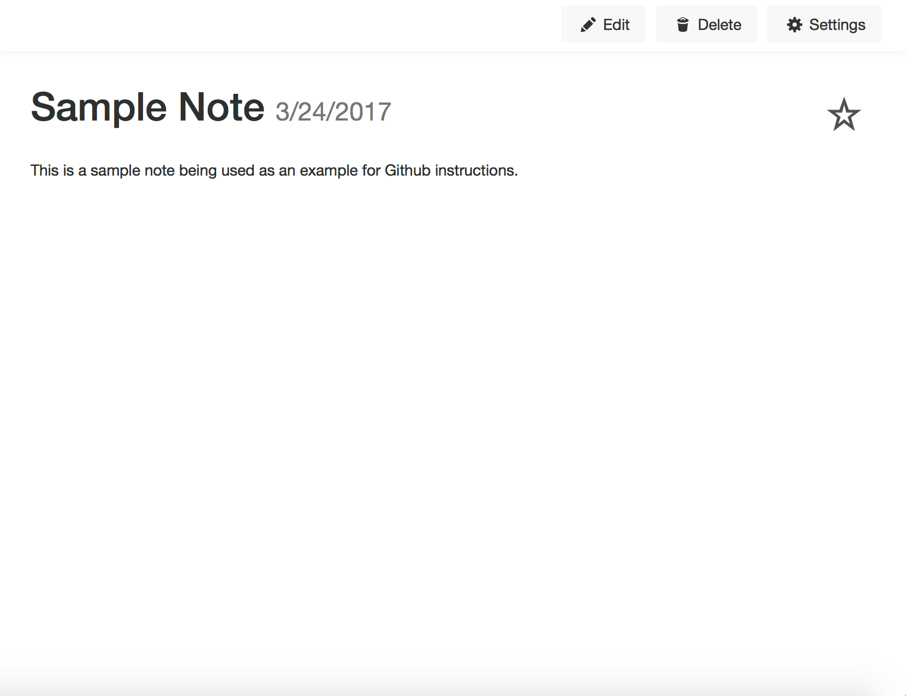
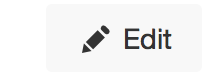
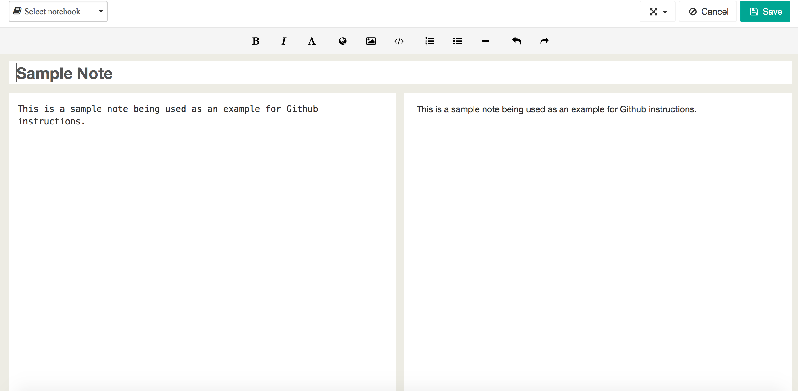
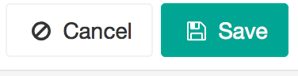

With an existing note open, look in the upper right corner of the window.

  
  
Click the edit button in the upper right corner of the window.

  
  
You will then be given access to edit the existing note. Remember to type in the left white box, the right white box is a preview of how your text will appear.

  
  
After you have edited the note, youc can either save your changes or delete them. These two options can be found in the upper right corner of the window. Click "cancel" to disgard your changes and "save" to save the changes you made.

