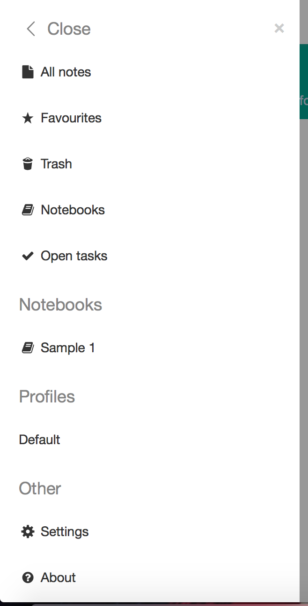
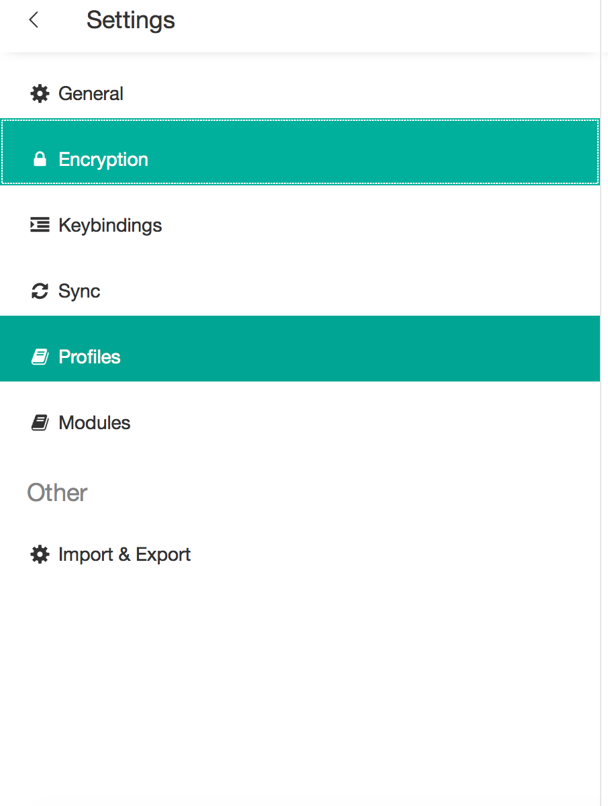
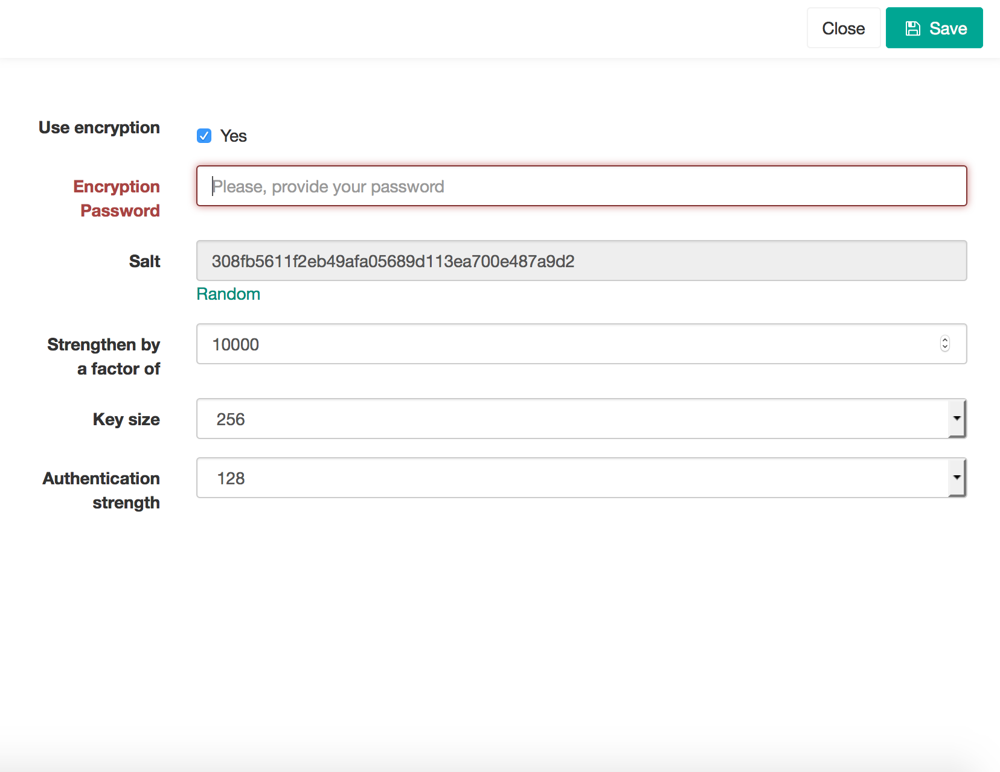

To add encryption, click on the three parallel lines in the upper left hand corner of the window.

  
  
The below list will appear. Click on Settings.

  
  
The far left column will appear, click "Encryption".

  
  
The right column will then look like the below picture. Check the "Use Encryption" box, by "Yes". Then type in a password you would like to protect your files with, in the "Encryption Password" box. Below the box is pictured in red. 

  
  
Look towards the upper right corner of the window for the "close" and "save" buttons. Click the "save" button. Then, click the "close" button. 
  

